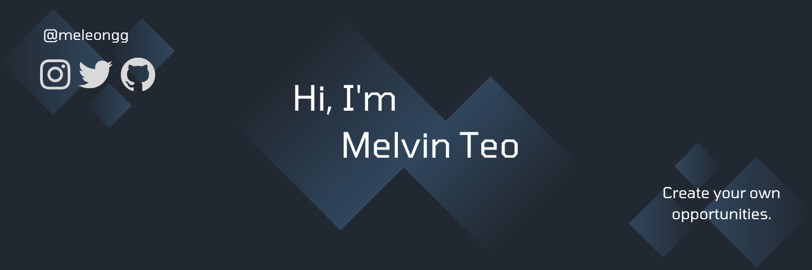

# Hi! 👋 I'm Melvin Teo (he/him) and a UBC CS Student

> Thanks for taking the time to visit my GitHub! If you have any inquiries, feel free to send an email to [mthteo@gmail.com](mailto:mthteo@gmail.com) or message me on my [LinkedIn](https://www.linkedin.com/in/melvinhteo/)! I've also got a [website](https://meleongg.github.io) with some of my past experience!

## 🔭 I’m currently working on:
### LastDash Transit Tracker -> [Take a Look](https://github.com/meleongg/lastdash) 👀
Learning how to use the Chakra UI React Component Library with Firebase while implementing Geocoding and Transit APIs. 

### nwPlus Aurora Design System -> [Take a Look](https://github.com/nwplus/Aurora) 👀
Contributing to the Aurora Design System that houses a variety of React components used for [nwPlus's](https://github.com/nwplus) websites ([nwhacks.io](https://nwhacks.io) | [hackcamp.nwplus.io](https://hackcamp.nwplus.io) | [cmd-f.nwplus.io](https://cmd-f.nwplus.io) | [nwplus.io](https://nwplus.io)).

## 🌱 I’m currently learning:
- React
- Firestore/Firebase

## ⚡ Fun facts:
- I play volleyball, a lot 🏐 
- I've biked the Vancouver Seawall 10 times 🚲
- I learn foreign languages too in my free time 🇫🇷 🇨🇳 

