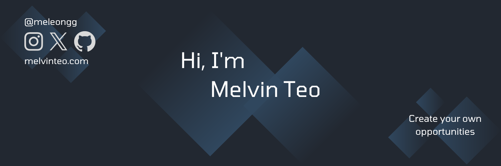

## 👋 Hi! I'm Melvin - a student, lifelong learner, and developer!

- 🧠 Passionate about Full-Stack Web Development, Generative AI, and NLP!
- 👔 SWE @ Amazon
- 📚 UBC CS '26
- 🔬 Prev Undergraduate Researcher @ UBC in NLP
- ⚙️ Prev Co-President, Director of Software Development, & Hackathon Logistics Director @ nwPlus
- 📝 Check out my [Resume](https://meleongg.github.io/resume/)!
- 📫 Reach out to me at mthteo@gmail.com

## 📑 Currently learning
- NLP & Mechanistic Interpretability (SAEs)
- System Design

## 🔭 Currently building
- TBD

## &#x1f4c8; GitHub Stats

